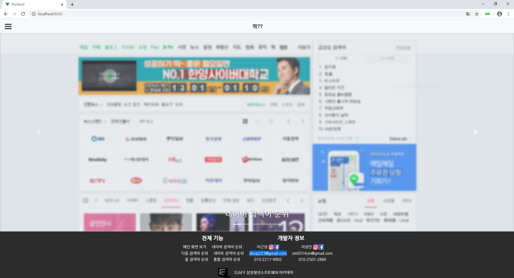
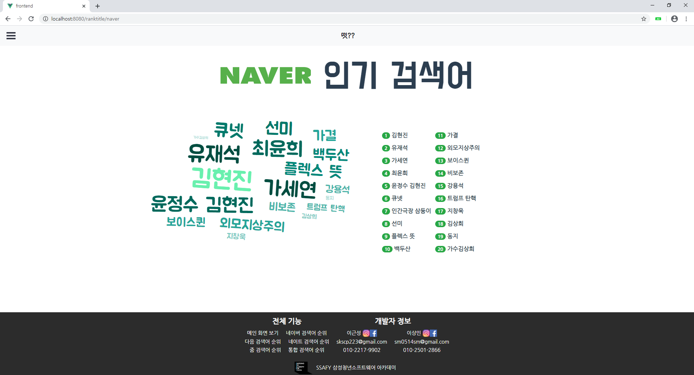
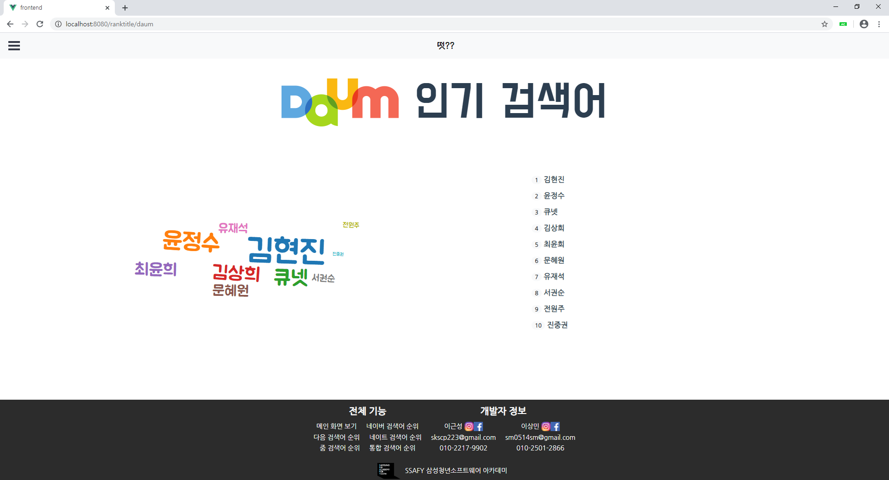
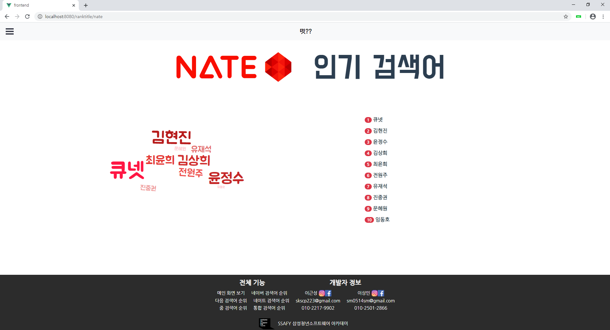
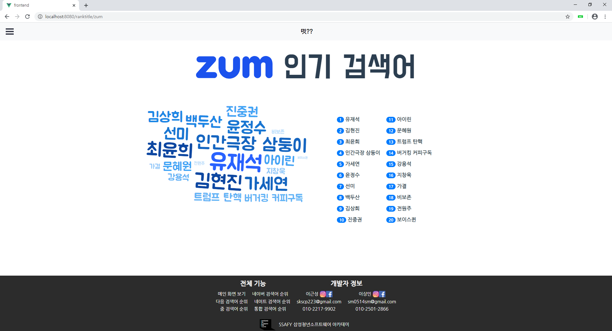
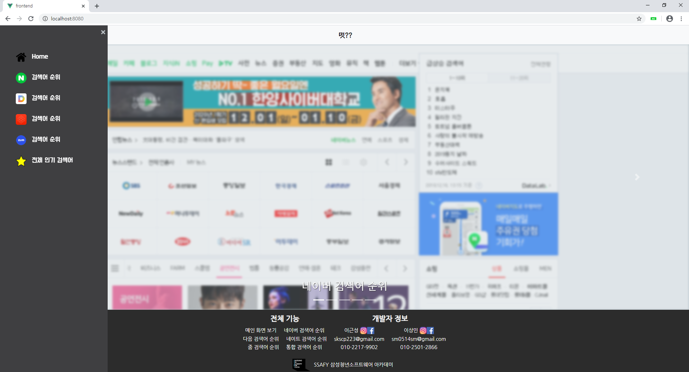

# ddut

<h2> 1. 설정 </h2>
- <h3>Frontend(Vue.js)</h3>
    ```
    npm install -g @vue/cli
    vue create frontend
```
    
    `frontend/src/http-common.js`에서 `baseURL`을 알맞는 URL로 고쳐야한다.
    
- <h3>Backend(Node.js)</h3>
    ```
    npm install -g express-generator
    express --view=pug backend
    npm install -g firebase-tools
    ```


## 2. 프로젝트 구조


## 3. 기능 설명

네이버, 다음, 네이트, 줌 인기검색어 

종합 인기 검색 순위


## 4. 화면 구성



> 메인 페이지




> 네이버 인기 검색어 페이지




> 다음 인기 검색어 페이지




> 네이트 인기 검색어 페이지




> 줌 인기 검색어 페이지




> 메뉴 클릭시

## 5. 만든이들

- Front-end 이상민 sm0514sm@gmail.com
- Back-end 이근성  skscp223@gmail.com 


